# Recommendation Engine Schedule Proposal

This is a first heuristic schedule proposal for the five DS-owned recommendation_engine DAGs.
It uses the existing working-hours constraint, the static dependency graph, and observed wait pressure from the DuckDB runtime views.

Across 4 rescheduled DAGs, the proposal removes about 13h 45m of pre-ready waiting time.

Heuristic rules:
- working-hours window: 08:00-18:00 UTC
- time bucket size: 15 minutes
- minimum stagger gap: 45 minutes
- reschedulable DAGs are treated as effectively starting when create_config begins
- finish by 19:00 UTC is modeled as a strong soft penalty using success-only post-create_config processing time
- timeline runtime bars use the median success-only processing duration as the typical completion estimate
- effective start is estimated as max(proposed cron, estimated upstream-ready time) plus a small observed post-ready setup lag
- waiting before upstream readiness is penalized more heavily than starting shortly after readiness
- dependency pressure buffer derived from mapped edge P90 idle wait
- multi-slot schedules are currently kept unchanged

## Waiting Saved

| DAG | Current wait before ready | Proposed wait before ready | Waiting saved | Estimated upstream ready UTC |
| --- | ---: | ---: | ---: | --- |
| relevance_scoring | 3h 28m | 3m | 3h 25m | 10:33 |
| recipe_recommender | 3h 25m | 0m | 3h 25m | 10:30 |
| user_clustering_predict | 2h 16m | 0m | 2h 16m | 09:21 |
| market_item_recommender | 4h 39m | 0m | 4h 39m | 08:44 |
| menu_ranker | 2m | 2m | 0m | 04:32 |

## Chronological Graph

```mermaid
gantt
    title Recommendation Engine Current vs Proposed Timing
    dateFormat HH:mm
    axisFormat %H:%M
    section relevance_scoring current
    Current wait (3h 28m) :crit, 07:05, 208m
    Current estimated run (12m) :active, 10:33, 12m
    section relevance_scoring proposed
    Proposed wait (3m) :active, 10:30, 3m
    Proposed estimated run (12m) :active, 10:33, 12m
    Wait saved (3h 25m) :done, 10:30, 205m
    section recipe_recommender current
    Current wait (3h 25m) :crit, 07:05, 205m
    Current estimated run (7h 23m) :active, 10:39, 443m
    section recipe_recommender proposed
    Proposed wait (0m) :active, 11:00, 0m
    Proposed post-ready gap (30m) :done, 10:30, 30m
    Proposed estimated run (7h 23m) :active, 11:09, 443m
    Wait saved (3h 25m) :done, 11:00, 205m
    section user_clustering_predict current
    Current wait (2h 16m) :crit, 07:05, 136m
    Current estimated run (5m) :active, 09:32, 5m
    section user_clustering_predict proposed
    Proposed wait (0m) :active, 09:30, 0m
    Proposed post-ready gap (9m) :done, 09:21, 9m
    Proposed estimated run (5m) :active, 09:41, 5m
    Wait saved (2h 16m) :done, 09:30, 136m
    section market_item_recommender current
    Current wait (4h 39m) :crit, 04:05, 279m
    Current estimated run (48m) :active, 08:45, 48m
    section market_item_recommender proposed
    Proposed wait (0m) :active, 08:45, 0m
    Proposed post-ready gap (1m) :done, 08:44, 1m
    Proposed estimated run (48m) :active, 08:46, 48m
    Wait saved (4h 39m) :done, 08:45, 279m
    section menu_ranker current
    Current wait (2m) :crit, 04:30, 2m
    Current estimated run (13m) :active, 04:32, 13m
    section menu_ranker proposed
    Proposed wait (2m) :active, 04:30, 2m
    Proposed estimated run (13m) :active, 04:32, 13m
    Wait saved (0m) :done, 04:30, 1m
    section utc scale
    00:00 UTC anchor :done, 00:00, 1m
```

## Schedule Details

| DAG | Current schedule | Proposed schedule | Current cron start UTC | Proposed cron start UTC | Estimated upstream ready UTC | Proposed gap after ready | Typical current finish UTC | Typical proposed finish UTC | Waiting saved | Shift min | Post-ready setup min | Pressure buffer min | Strategy |
| --- | --- | --- | --- | --- | --- | ---: | --- | --- | ---: | ---: | ---: | ---: | --- |
| relevance_scoring | 05 07 * * * | 30 10 * * * | 07:05 | 10:30 | 10:33 | 0m | 10:45 | 10:45 | 205 | 205 | 0 | 1 | upstream_ready_slot_search |
| recipe_recommender | 05 07 * * 3 | 0 11 * * 3 | 07:05 | 11:00 | 10:30 | 30m | 18:02 | 18:32 | 205 | 235 | 9 | 1 | upstream_ready_slot_search |
| user_clustering_predict | 05 07 * * 3 | 30 9 * * 3 | 07:05 | 09:30 | 09:21 | 9m | 09:37 | 09:46 | 136 | 145 | 11 | 1 | upstream_ready_slot_search |
| market_item_recommender | 05 04 * * 3 | 45 8 * * 3 | 04:05 | 08:45 | 08:44 | 1m | 09:33 | 09:34 | 279 | 280 | 1 | 1 | upstream_ready_slot_search |
| menu_ranker | 30 4,18 * * * | 30 4,18 * * * | 04:30 | 04:30 | 04:32 | 0m | 04:45 | 04:45 | 0 | 0 | 0 | 0 | kept_existing_multi_slot_schedule |
