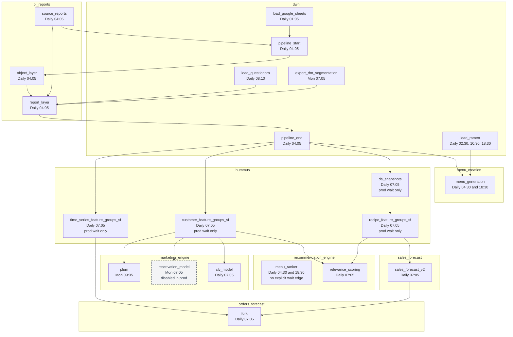

## Airflow DAG schedules & dependencies (Monday DS-focused)

Generated from the Monday-running DS DAG definitions under `hedwig/dags/**` plus the recursively referenced upstream DAGs found in `hummus`, `dwh`, `bi_reports`, `recommendation_engine`, `marketing_engine`, `orders_forecast`, `sales_forecast`, and `menu_creation`.

## Assumptions / notes

- Times are interpreted as UTC unless your Airflow deployment overrides timezone handling.
- `ExternalTaskSensor` / `HedwigExternalTaskSensor` implies an explicit inter-DAG wait dependency.
- This scope is broader than the original Monday draft: it includes daily DS DAGs that also execute on Mondays.
- `reactivation_model` is currently disabled in production, but it is kept visible in the graph for completeness.
- `menu_ranker` still has no explicit wait edge in its DAG definition; any dependency on `menu_generation` is operational rather than enforced.
- `forkforce` was checked and intentionally excluded because it is scheduled on Tuesdays (`05 07 * * 2`), not Mondays.
- `customer_feature_groups_sf -> pipeline_end`, `recipe_feature_groups_sf -> ds_snapshots`, `ds_snapshots -> pipeline_end`, and `time_series_feature_groups_sf -> pipeline_end` are production-only waits in hummus. Outside production those waits are replaced by `HedwigEmptyOperator`, so treat them as conditional edges in a static graph and as enforced edges for production runtime analysis.
- The `source_reports` fan-in is expanded because it materially constrains the `pipeline_start -> object_layer -> report_layer -> pipeline_end` chain that gates several Monday-running DS DAGs.

## DAG inventory

| DAG ID                          | Repo                  | Schedule (resolved) | Cadence (human)                                     |
| ------------------------------- | --------------------- | ------------------- | --------------------------------------------------- |
| `menu_ranker`                   | recommendation_engine | `30 4,18 * * *`     | Daily: 04:30 and 18:30                              |
| `relevance_scoring`             | recommendation_engine | `05 07 * * *`       | Daily: 07:05                                        |
| `plum`                          | marketing_engine      | `05 9 * * 1`        | Weekly: Mon 09:05                                   |
| `reactivation_model`            | marketing_engine      | `05 07 * * 1`       | Weekly: Mon 07:05, currently disabled in production |
| `fork`                          | orders_forecast       | `05 07 * * *`       | Daily: 07:05                                        |
| `sales_forecast_v2`             | sales_forecast        | `05 07 * * *`       | Daily: 07:05                                        |
| `clv_model`                     | marketing_engine      | `05 07 * * *`       | Daily: 07:05                                        |
| `menu_generation`               | menu_creation         | `30 4,18 * * *`     | Daily: 04:30 and 18:30                              |
| `customer_feature_groups_sf`    | hummus                | `05 07 * * *`       | Daily: 07:05                                        |
| `recipe_feature_groups_sf`      | hummus                | `05 07 * * *`       | Daily: 07:05                                        |
| `time_series_feature_groups_sf` | hummus                | `05 07 * * *`       | Daily: 07:05                                        |
| `ds_snapshots`                  | hummus                | `05 07 * * *`       | Daily: 07:05                                        |
| `pipeline_end`                  | dwh                   | `05 04 * * *`       | Daily: 04:05                                        |
| `pipeline_start`                | dwh                   | `05 04 * * *`       | Daily: 04:05                                        |
| `load_google_sheets`            | dwh                   | `05 01 * * *`       | Daily: 01:05                                        |
| `load_questionpro`              | dwh                   | `10 8 * * *`        | Daily: 08:10                                        |
| `export_rfm_segmentation`       | dwh                   | `05 07 * * 1`       | Weekly: Mon 07:05                                   |
| `report_layer`                  | bi_reports            | `05 04 * * *`       | Daily: 04:05                                        |
| `object_layer`                  | bi_reports            | `05 04 * * *`       | Daily: 04:05                                        |
| `source_reports`                | bi_reports            | `05 04 * * *`       | Daily: 04:05                                        |

## Cross-DAG dependencies

### Direct dependencies from Monday-running DS DAGs

| Dependent DAG        | Waits for external DAG          | External task                | Notes                                                                 |
| -------------------- | ------------------------------- | ---------------------------- | --------------------------------------------------------------------- |
| `relevance_scoring`  | `customer_feature_groups_sf`    | `end`                        | explicit wait                                                         |
| `relevance_scoring`  | `recipe_feature_groups_sf`      | `end`                        | explicit wait                                                         |
| `plum`               | `customer_feature_groups_sf`    | `end`                        | explicit wait                                                         |
| `reactivation_model` | `customer_feature_groups_sf`    | `end`                        | uses `execution_delta=-6 days`; currently disabled in prod            |
| `fork`               | `time_series_feature_groups_sf` | `end`                        | explicit wait                                                         |
| `fork`               | `sales_forecast_v2`             | `ge_test_prediction_results` | explicit wait                                                         |
| `sales_forecast_v2`  | `recipe_feature_groups_sf`      | `end`                        | explicit wait                                                         |
| `clv_model`          | `customer_feature_groups_sf`    | `end`                        | explicit wait                                                         |
| `menu_generation`    | `pipeline_end`                  | `dag_start_task`             | explicit wait                                                         |
| `menu_generation`    | `load_ramen`                    | latest successful run        | explicit wait; sensor has no explicit task id                         |
| `menu_ranker`        | none explicitly modeled         | n/a                          | operationally aligned with menu_generation, but no sensor edge exists |

### Recursive upstream dependencies introduced by those waits

| Dependent DAG                   | Waits for external DAG    | External task                 | Notes                         |
| ------------------------------- | ------------------------- | ----------------------------- | ----------------------------- |
| `customer_feature_groups_sf`    | `pipeline_end`            | `dag_start_task`              | production-only enforced edge |
| `recipe_feature_groups_sf`      | `ds_snapshots`            | `end`                         | production-only enforced edge |
| `ds_snapshots`                  | `pipeline_end`            | `dag_start_task`              | production-only enforced edge |
| `time_series_feature_groups_sf` | `pipeline_end`            | `dag_start_task`              | production-only enforced edge |
| `pipeline_end`                  | `report_layer`            | `dag_end_task`                | explicit wait                 |
| `report_layer`                  | `object_layer`            | `dag_end_task`                | explicit wait                 |
| `report_layer`                  | `object_layer_bistromd`   | `dag_end_task`                | `execution_delta=-4h05m`      |
| `report_layer`                  | `object_layer_balance`    | `dag_end_task`                | `execution_delta=-4h05m`      |
| `report_layer`                  | `source_reports`          | `zendesk_tg.end_zendesk`      | task-group specific           |
| `report_layer`                  | `load_questionpro`        | `end_sourcing_task`           | explicit wait                 |
| `report_layer`                  | `export_rfm_segmentation` | `end`                         | explicit wait                 |
| `object_layer`                  | `pipeline_start`          | `dag_end_task`                | explicit wait                 |
| `pipeline_start`                | `source_reports`          | multiple task-group end tasks | fan-in dependency             |
| `pipeline_start`                | `ramen_source_reports`    | `end_ramen`                   | explicit wait                 |
| `pipeline_start`                | `load_google_sheets`      | `end_task`                    | explicit wait                 |

### Expanded `source_reports` fan-in

These are the explicit upstream loads that feed `source_reports`, which then feeds `pipeline_start`, `object_layer`, `report_layer`, `pipeline_end`, and several Monday-running DS DAG paths.

| Upstream DAG              | Schedule (resolved) | How it feeds `source_reports`                                                            |
| ------------------------- | ------------------- | ---------------------------------------------------------------------------------------- |
| `load_ods_bmd_menuadmin`  | `00 8 * * *`        | explicit wait                                                                            |
| `load_ods_ms`             | `00 02 * * *`       | explicit wait                                                                            |
| `load_ods_ms_acquisition` | `00 02 * * *`       | explicit wait                                                                            |
| `load_ods_onion`          | `00 01 * * *`       | explicit wait                                                                            |
| `load_ods_radar`          | `00 01 * * *`       | explicit wait                                                                            |
| `load_ods_rewards`        | `05 01 * * *`       | explicit wait                                                                            |
| `load_ods_breadcrumbs`    | `10 01 * * *`       | explicit wait                                                                            |
| `load_ods_paysys`         | `10 01 * * *`       | explicit wait                                                                            |
| `load_ods_spm`            | `15 01 * * *`       | explicit wait                                                                            |
| `load_ods_beef`           | `20 01 * * *`       | explicit wait                                                                            |
| `load_ods_sauerkraut`     | `20 01 * * *`       | explicit wait                                                                            |
| `load_nav_at`             | `05 03 * * *`       | explicit wait                                                                            |
| `load_nav_de`             | `05 03 * * *`       | explicit wait                                                                            |
| `load_nav_nl`             | `05 03 * * *`       | explicit wait                                                                            |
| `load_nav_pt`             | `05 03 * * *`       | explicit wait                                                                            |
| `load_nav_uk`             | `05 03 * * *`       | explicit wait                                                                            |
| `load_nav_us`             | `05 11 * * *`       | explicit wait with `execution_delta=-7h`                                                 |
| `load_nav_au`             | `05 17 * * *`       | explicit wait with `execution_delta=-13h`                                                |
| `load_google_sheets`      | `05 01 * * *`       | explicit wait with `execution_delta=+3h`                                                 |
| `load_zendesk`            | `35 01 * * *`       | explicit wait                                                                            |
| `load_ramen`              | `30 2,10,18 * * *`  | via `ramen_source_reports`, then `pipeline_start`; also directly gates `menu_generation` |

### Machine-readable model

The normalized Monday-DS-focused dependency graph is available in `monday_ds_dag_dependencies.json` in this directory.

The scheduling-oriented model is available in `monday_ds_schedule_optimization_model.json` in this directory. It separates DAG attributes, precedence constraints, optimization defaults, and the future planned-vs-actual runtime comparison schema.

## Dependency graph (Mermaid)

## Schedule view

### Monday-running DS DAGs in scope

- 04:30 and 18:30 daily: `menu_ranker`
- 07:05 daily: `relevance_scoring`
- 09:05 Monday: `plum`
- 07:05 Monday: `reactivation_model` (currently disabled in production)
- 07:05 daily: `fork`
- 07:05 daily: `sales_forecast_v2`
- 07:05 daily: `clv_model`
- 04:30 and 18:30 daily: `menu_generation`

### Key upstream schedules affecting Monday DS

- 07:05 daily: `customer_feature_groups_sf`, `recipe_feature_groups_sf`, `time_series_feature_groups_sf`, `ds_snapshots`
- 04:05 daily: `pipeline_end`, `report_layer`, `object_layer`, `source_reports`, `pipeline_start`
- 01:05 daily: `load_google_sheets`
- 08:10 daily: `load_questionpro`
- 07:05 Monday: `export_rfm_segmentation`
- 02:30, 10:30 and 18:30 daily: `load_ramen`
