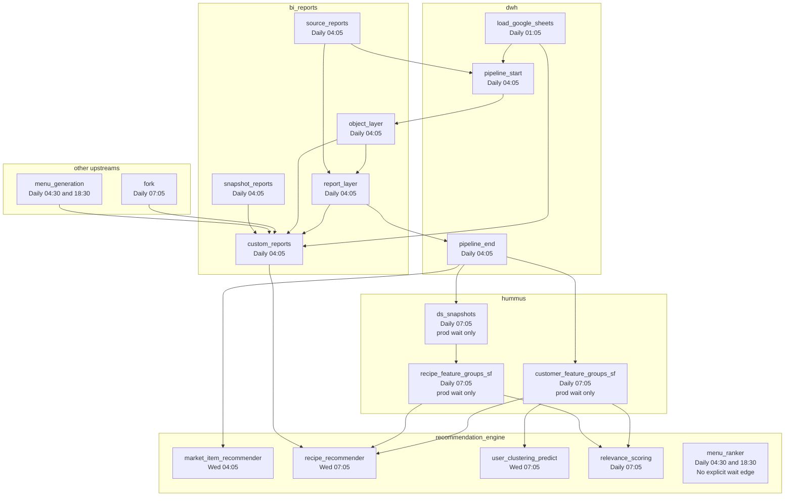

## Airflow DAG schedules & dependencies (recommendation_engine-focused)

Generated from the recommendation_engine DAG definitions under `hedwig/dags/**` plus the recursively referenced upstream DAGs found in `hummus`, `dwh`, `bi_reports`, `orders_forecast`, and `menu_creation`.

## Assumptions / notes

- Times are interpreted as UTC unless your Airflow deployment overrides timezone handling.
- `ExternalTaskSensor` / `HedwigExternalTaskSensor` implies an explicit inter-DAG wait dependency.
- `menu_ranker` still has no explicit wait edge in its DAG definition; any dependency on `menu_generation` is operational rather than enforced.
- `recipe_recommender -> custom_reports` is a custom logical-date alignment, not a plain latest-run wait. `custom_reports_schedule_date_time()` maps the recommender logical date to the same calendar date at `04:05 UTC`.
- Some hummus waits are conditional on production only:
  - `customer_feature_groups_sf -> pipeline_end`
  - `recipe_feature_groups_sf -> ds_snapshots`
  - `ds_snapshots -> pipeline_end`
    Outside production those waits are replaced by `HedwigEmptyOperator`, so treat them as conditional edges in a static graph and as enforced edges for production runtime analysis.

## DAG inventory

| DAG ID                       | Repo                  | Schedule (resolved) | Cadence (human)        |
| ---------------------------- | --------------------- | ------------------- | ---------------------- |
| `market_item_recommender`    | recommendation_engine | `05 04 * * 3`       | Weekly: Wed 04:05      |
| `recipe_recommender`         | recommendation_engine | `05 07 * * 3`       | Weekly: Wed 07:05      |
| `user_clustering_predict`    | recommendation_engine | `05 07 * * 3`       | Weekly: Wed 07:05      |
| `menu_ranker`                | recommendation_engine | `30 4,18 * * *`     | Daily: 04:30 and 18:30 |
| `relevance_scoring`          | recommendation_engine | `05 07 * * *`       | Daily: 07:05           |
| `custom_reports`             | bi_reports            | `05 04 * * *`       | Daily: 04:05           |
| `report_layer`               | bi_reports            | `05 04 * * *`       | Daily: 04:05           |
| `object_layer`               | bi_reports            | `05 04 * * *`       | Daily: 04:05           |
| `source_reports`             | bi_reports            | `05 04 * * *`       | Daily: 04:05           |
| `snapshot_reports`           | bi_reports            | `05 04 * * *`       | Daily: 04:05           |
| `pipeline_start`             | dwh                   | `05 04 * * *`       | Daily: 04:05           |
| `pipeline_end`               | dwh                   | `05 04 * * *`       | Daily: 04:05           |
| `load_google_sheets`         | dwh                   | `05 01 * * *`       | Daily: 01:05           |
| `customer_feature_groups_sf` | hummus                | `05 07 * * *`       | Daily: 07:05           |
| `recipe_feature_groups_sf`   | hummus                | `05 07 * * *`       | Daily: 07:05           |
| `ds_snapshots`               | hummus                | `05 07 * * *`       | Daily: 07:05           |
| `fork`                       | orders_forecast       | `05 07 * * *`       | Daily: 07:05           |
| `menu_generation`            | menu_creation         | `30 4,18 * * *`     | Daily: 04:30 and 18:30 |

## Cross-DAG dependencies

### Direct dependencies from recommendation_engine DAGs

| Dependent DAG             | Waits for external DAG       | External task    | Notes                                                      |
| ------------------------- | ---------------------------- | ---------------- | ---------------------------------------------------------- |
| `market_item_recommender` | `pipeline_end`               | `dag_start_task` | explicit wait                                              |
| `recipe_recommender`      | `customer_feature_groups_sf` | `end`            | explicit wait                                              |
| `recipe_recommender`      | `recipe_feature_groups_sf`   | `end`            | explicit wait                                              |
| `recipe_recommender`      | `custom_reports`             | `dag_end_task`   | uses `execution_date_fn=custom_reports_schedule_date_time` |
| `user_clustering_predict` | `customer_feature_groups_sf` | `end`            | explicit wait                                              |
| `relevance_scoring`       | `customer_feature_groups_sf` | `end`            | explicit wait                                              |
| `relevance_scoring`       | `recipe_feature_groups_sf`   | `end`            | explicit wait                                              |

### Recursive upstream dependencies introduced by those waits

| Dependent DAG                | Waits for external DAG    | External task                                     | Notes                         |
| ---------------------------- | ------------------------- | ------------------------------------------------- | ----------------------------- |
| `customer_feature_groups_sf` | `pipeline_end`            | `dag_start_task`                                  | production-only enforced edge |
| `recipe_feature_groups_sf`   | `ds_snapshots`            | `end`                                             | production-only enforced edge |
| `ds_snapshots`               | `pipeline_end`            | `dag_start_task`                                  | production-only enforced edge |
| `pipeline_end`               | `report_layer`            | `dag_end_task`                                    | explicit wait                 |
| `custom_reports`             | `report_layer`            | `dag_end_task`                                    | explicit wait                 |
| `custom_reports`             | `object_layer`            | `load_end_task`                                   | explicit wait                 |
| `custom_reports`             | `fork`                    | `ge_test_ingredient_prediction`                   | task-group specific           |
| `custom_reports`             | `menu_generation`         | `end`                                             | task-group specific           |
| `custom_reports`             | `snapshot_reports`        | `tg_monday_snapshots.tg_default.end_default_task` | task-group specific           |
| `custom_reports`             | `load_google_sheets`      | `manual_sheets_edit_end_task`                     | task-group specific           |
| `report_layer`               | `object_layer`            | `dag_end_task`                                    | explicit wait                 |
| `report_layer`               | `object_layer_bistromd`   | `dag_end_task`                                    | `execution_delta=-4h05m`      |
| `report_layer`               | `object_layer_balance`    | `dag_end_task`                                    | `execution_delta=-4h05m`      |
| `report_layer`               | `source_reports`          | `zendesk_tg.end_zendesk`                          | task-group specific           |
| `report_layer`               | `load_questionpro`        | `end_sourcing_task`                               | explicit wait                 |
| `report_layer`               | `export_rfm_segmentation` | `end`                                             | explicit wait                 |
| `object_layer`               | `pipeline_start`          | `dag_end_task`                                    | explicit wait                 |
| `pipeline_start`             | `source_reports`          | multiple task-group end tasks                     | fan-in dependency             |
| `pipeline_start`             | `ramen_source_reports`    | `end_ramen`                                       | explicit wait                 |
| `pipeline_start`             | `load_google_sheets`      | `end_task`                                        | explicit wait                 |

### Expanded `source_reports` fan-in

These are the explicit upstream loads that feed `source_reports`, which then feeds `pipeline_start`, `report_layer`, `pipeline_end`, and some recommendation_engine-relevant paths.

| Upstream DAG              | Schedule (resolved) | How it feeds `source_reports`                     |
| ------------------------- | ------------------- | ------------------------------------------------- |
| `load_ods_bmd_menuadmin`  | `00 8 * * *`        | explicit wait                                     |
| `load_ods_ms`             | `00 02 * * *`       | explicit wait                                     |
| `load_ods_ms_acquisition` | `00 02 * * *`       | explicit wait                                     |
| `load_ods_onion`          | `00 01 * * *`       | explicit wait                                     |
| `load_ods_radar`          | `00 01 * * *`       | explicit wait                                     |
| `load_ods_rewards`        | `05 01 * * *`       | explicit wait                                     |
| `load_ods_breadcrumbs`    | `10 01 * * *`       | explicit wait                                     |
| `load_ods_paysys`         | `10 01 * * *`       | explicit wait                                     |
| `load_ods_spm`            | `15 01 * * *`       | explicit wait                                     |
| `load_ods_beef`           | `20 01 * * *`       | explicit wait                                     |
| `load_ods_sauerkraut`     | `20 01 * * *`       | explicit wait                                     |
| `load_nav_at`             | `05 03 * * *`       | explicit wait                                     |
| `load_nav_de`             | `05 03 * * *`       | explicit wait                                     |
| `load_nav_nl`             | `05 03 * * *`       | explicit wait                                     |
| `load_nav_pt`             | `05 03 * * *`       | explicit wait                                     |
| `load_nav_uk`             | `05 03 * * *`       | explicit wait                                     |
| `load_nav_us`             | `05 11 * * *`       | explicit wait with `execution_delta=-7h`          |
| `load_nav_au`             | `05 17 * * *`       | explicit wait with `execution_delta=-13h`         |
| `load_google_sheets`      | `05 01 * * *`       | explicit wait with `execution_delta=+3h`          |
| `load_zendesk`            | `35 01 * * *`       | explicit wait                                     |
| `load_ramen`              | `30 2,10,18 * * *`  | via `ramen_source_reports`, then `pipeline_start` |

### Machine-readable model

The normalized recommendation_engine-focused dependency graph is available in `recommendation_engine_dag_dependencies.json` in this directory.

The scheduling-oriented model is available in `recommendation_engine_schedule_optimization_model.json` in this directory. It separates DAG attributes, precedence constraints, optimization defaults, and the future planned-vs-actual runtime comparison schema.

## Dependency graph (Mermaid)

## Schedule view

### Recommendation_engine seeds

- 04:05 Wednesday: `market_item_recommender`
- 07:05 Wednesday: `recipe_recommender`
- 07:05 Wednesday: `user_clustering_predict`
- 07:05 daily: `relevance_scoring`
- 04:30 and 18:30 daily: `menu_ranker`

### Key upstream schedules affecting recommendation_engine

- 04:05 daily: `pipeline_end`, `report_layer`, `custom_reports`, `object_layer`, `source_reports`, `snapshot_reports`, `pipeline_start`
- 01:05 daily: `load_google_sheets`
- 07:05 daily: `customer_feature_groups_sf`, `recipe_feature_groups_sf`, `ds_snapshots`, `fork`
- 04:30 and 18:30 daily: `menu_generation`
